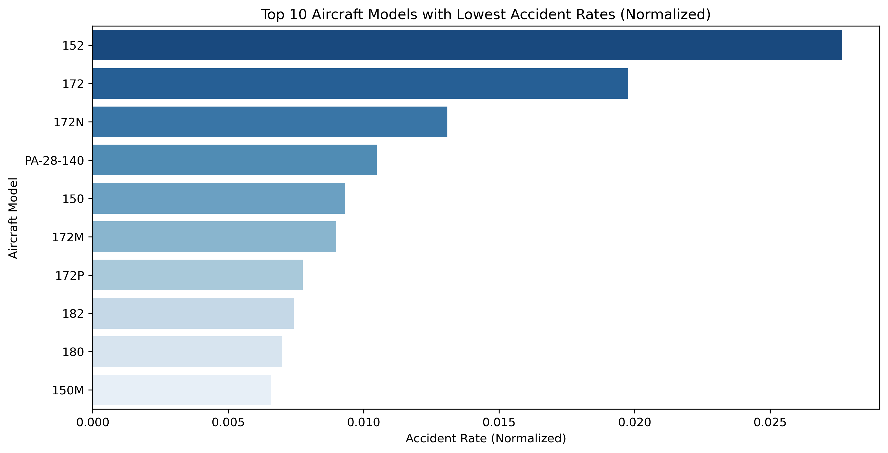

# Navigating Aviation Risks for Business Expansion

**Authors:** Kigen Tuwei
***
## Overview

***
In this project, we analyze aviation accident data to help a company decide which aircraft types are the safest for their new aviation business. The dataset, sourced from the National Transportation Safety Board, contains civil aviation accident records from 1962 to 2023 [Aviation Data](./AviationData.csv). We also have US_State data with abbreviations [US State Codes](./USState_Codes.csv). 

Using **data cleaning, imputation, exploratory analysis, and visualization**, we identify key risk factors associated with different aircraft models, flight purposes, weather conditions, and accident phases. Our findings provide **three actionable business recommendations** to guide the company in selecting low-risk aircraft.  
***
## Business Problem

***
As part of its diversification strategy, our company plans to enter the aviation industry by purchasing and operating aircraft for commercial and private use. However, a major concern is **understanding the risks associated with different aircraft types** before making investment decisions.  

To address this, we aim to answer the following key questions: 

1. **Which aircraft models have the lowest accident rates?**  
2. **How does flight purpose affect accident risk?**  
3. **What role do weather conditions play in aviation accidents?**  
4. **Which phases of flight (takeoff, landing, cruise) are the riskiest?**
***
## Data Understanding

***
In this project, we use aviation accident data [AviationData.csv](./AviationData.csv) from the **National Transportation Safety Board (NTSB)**, which contains records of civil aviation accidents from **1962 to 2023**. The dataset provides insights into **aircraft types, accident causes, weather conditions, and flight phases** all crucial for assessing aviation risks. We also have state code data [USState_Codes.csv](./USState_Codes.csv) for location mapping 
***
## Data Preparation
​
Below are some of the processes I'll be using to clean the data to ensure a higher degree of accuracy and to provide better insights:
​
***
1. **Handling Missing Values**: I'll be dropping columns with excessive nulls and replacing them using median (for numeric values) and mode (for categoric values).    
2. **Feature Engineering**: New variables such as "Injury Severity Score" and "Risk Level" will be created to better assess accident severity.  
3. **Merging Datasets**: The aviation dataset will be merged with the U.S. state codes dataset to provide location-based insights.  
***
## Data Modeling

I applied a structured approach to analyzing aviation accident data, ensuring insights are relevant to accident risk factors. I used a **bar chart**, **box plot**, **scatter plot** and **line chart** to help visualize and model the data

***
1. A **bar chart** was used to compare the aircraft model to accident rate so as to inform on the safer models.
2. A **box plot** was used to illustrate the distribution of accident severity across different flight purposes, revealing which types of flights tend to have more severe incidents.  
3. A **scatter plot** was used to explore the relationship between weather conditions and accident severity, providing insights into how hazardous weather impacts aviation safety. 
4. A **line chart** was used to track accident trends over time for different flight phases, showing changes in aviation safety across years.  
***
## Results
The 152, 172, 172N and PA=28-140 are the most safest models.

It is clear Aerial Survey and Photo(ASHO), Skydiving, Firefighting and Air Race Show are high on severity and therefore should be avoided.

The green dots 'Instrument Meteorological Conditions(IMC)' show a wider spread of severity values, suggesting that accidents in IMC tend to have more severe consequences.

The blue dots 'Visual Meteorological Conditions(VMC)' are mostly clustered at the lower severity levels, meaning accidents in clear weather tend to be less severe.

The orange dots 'Unknown Conditions(UNK)' appear spread out but not as severe as IMC.

The 'orange line (Landing)' shows consistently higher accident counts compared to 'Takeoff (green)' and 'Cruise (blue)'.

The 'green line (Takeoff)' follows a similar downward trend as Landing, but with a lower accident count overall.

There has been a spike in landing accidents post-2010.

## Evaluation

Based on our earlier objectives we've been able to narrow down the risk averse areas and risk prone areas.

***
This analysis leads to three recommendations for the Head of Aviation:

1. The most accident prone **flight phases are takeoff and landing**. I would therefore advise the Head of Aviation to **invest in training and/or acquiring skilled pilot, so as to, to reduce the probability of takeoff/landing accidents**. Also, **I would urge him/her to invest in airport structure improvements and maintenance** to reduce risk of takeoff/landing accidents.

2. It seems accidents in **Instrument Meteorological Conditions (IMC) tend to be more severe**. Therefore, I would recommend enhancing pilot training for IMC scenarios. Secondly, I would recommend improving the data collection on **Unknown Conditions (UNK)** herreby, increasing our ability to analyze risk.

3. I would recommend investing in aircraft models with the lowest accident rates, such as; **152,172,172N and PA-28-140** and avoiding those with high accident rates, such as; **150M, 180, 182, 172P**.

***
## Conclusions

The analysis of **aviation accident trends** across various factors; weather conditions, flight phase, accident rates, and flight purpose has provided valuable insights for improving aviation safety. Key findings include:  

- **Weather Conditions:** Accidents in **IMC (Instrument Meteorological Conditions)** are more severe, suggesting the need for enhanced pilot training and improved onboard safety systems.  

- **Flight Phase Trends:** A significant portion of accidents occur during **takeoff and landing**, highlighting the importance of procedural improvements and pilot alertness in these phases.  

- **Accident Rates Over Time:** While accident rates may have declined, fluctuations indicate ongoing risks, necessitating continued monitoring and proactive safety measures.  

- **Flight Purpose & Severity:** General aviation flights tend to have higher accident severity than commercial flights, emphasizing the need for stricter regulations and improved training for private pilots.  

### Limitations of The Analysis

**Data Completeness:** Some accidents were classified under "Unknown Conditions" (UNK), reducing clarity in certain risk assessments.  

### Next Steps

**Expand the Dataset:** Incorporate more variables, such as **aircraft type, pilot experience, and maintenance records**, to refine accident analysis.  
 **Regulatory Impact Assessment:** Evaluate how past **aviation regulations and technological advancements** have influenced safety trends.  

